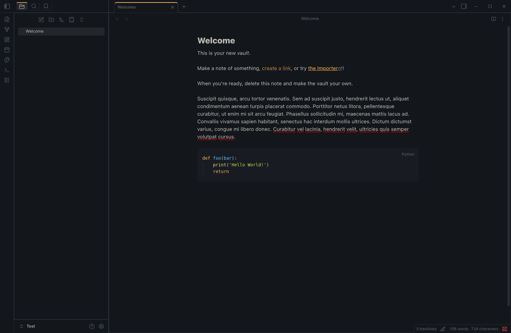
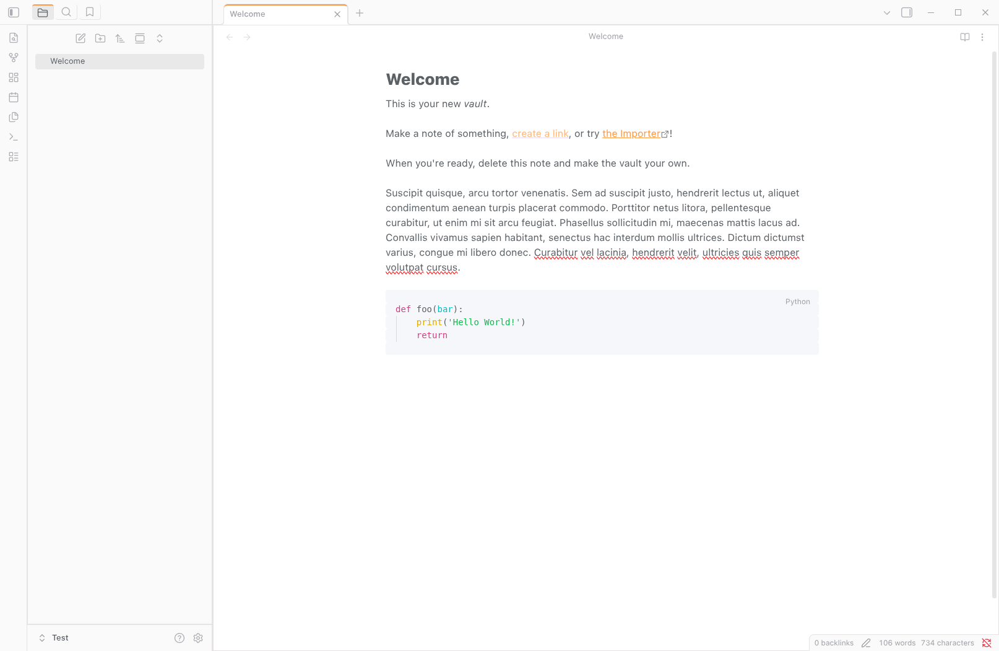

# Ayu Bordered for Obsidian

A port of the Ayu Bordered theme for [Obsidian](https://obsidian.md). This theme is designed to look very similar to the [Ayu theme for VS Code](https://github.com/ayu-theme/vscode-ayu). It supports both light and dark modes.

#### Dark Bordered

#### Light Bordered

## Features

* **Accurate Palette:** Uses the canonical Ayu Dark and Light hex codes.
* **Bordered UI:** Distinct borders around panes and sidebars, mimicking the VS Code "Bordered" variant.
* **Syntax Highlighting:** Custom colouring for code blocks (Python, JS, etc.) to match Ayu's specific syntax spec (Green strings, Orange keywords).
* **Native Fonts:** Respects your custom font settings in Obsidian while enforcing monospace for code.

## Installation

### Manual Installation

1. Download the latest release (specifically `theme.css` and `manifest.json`).
2. Open your Obsidian Vault folder.
3. Navigate to `.obsidian/themes/`.
4. Create a new folder named `Obsidian-Ayu-Bordered`.
5. Paste the files into that folder.
6. Open Obsidian Settings > Appearance > Themes and select Obsidian-Ayu-Bordered.
7. Restart Obsidian and then select the theme from the dropdown.

### Updates

This theme is currently maintained manually. If you encounter issues with specific plugins, please open an issue on this repository.

## Credits & License

This project is a port of the [Ayu Theme for VS Code](https://github.com/ayu-theme/vscode-ayu).

* **Original Authors:** [teabyii](https://github.com/teabyii) and [dempfi](https://github.com/dempfi).
* **License:** MIT

The code in this repository is licensed under AGPL3.
